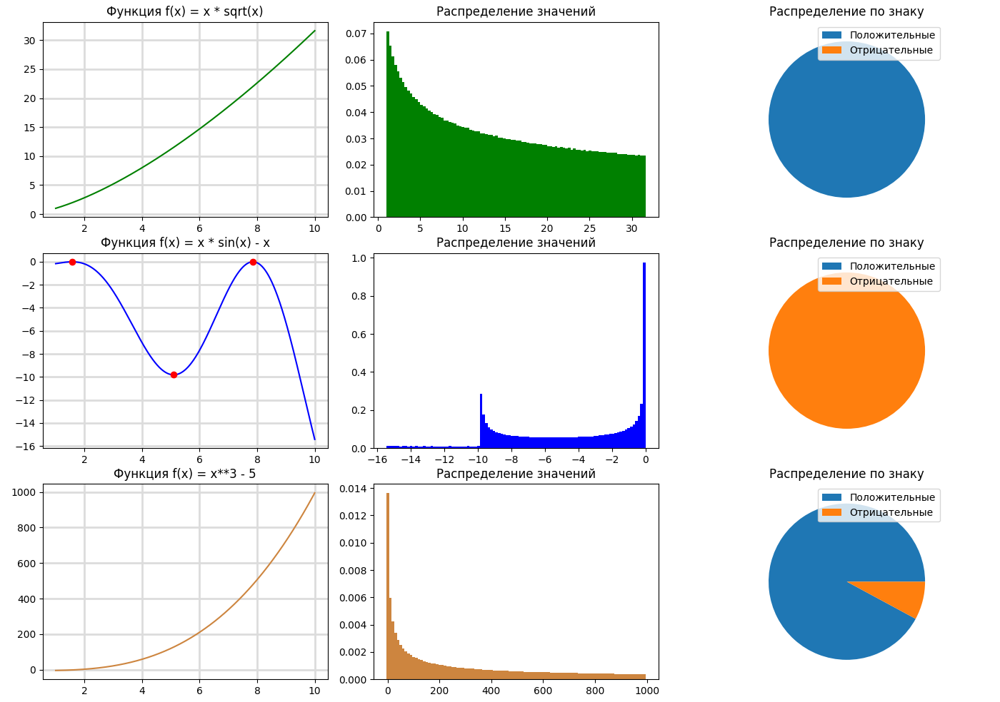

# Что?
Приложение для построения и анализа графиков функций

# Как?

Запускается с помощью
```
python3 main.py
```
В появившемся окне можно выбрать количество графиков, которое нужно построить, указать отрезок, на котором будут строиться графики, а также ввести сами функции.

# А пример?



# А если?

Если при построении графика возникает ошибка (например извлечение корня из отрицательного числа), то программа не построит график, и пользователю придётся исправить ошибку.